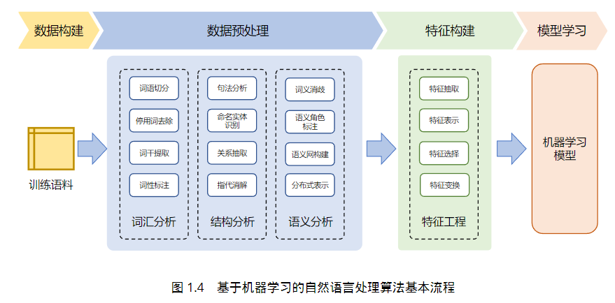
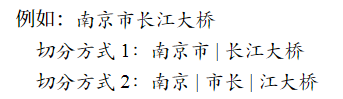
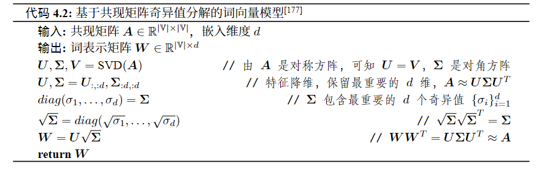
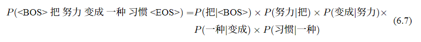
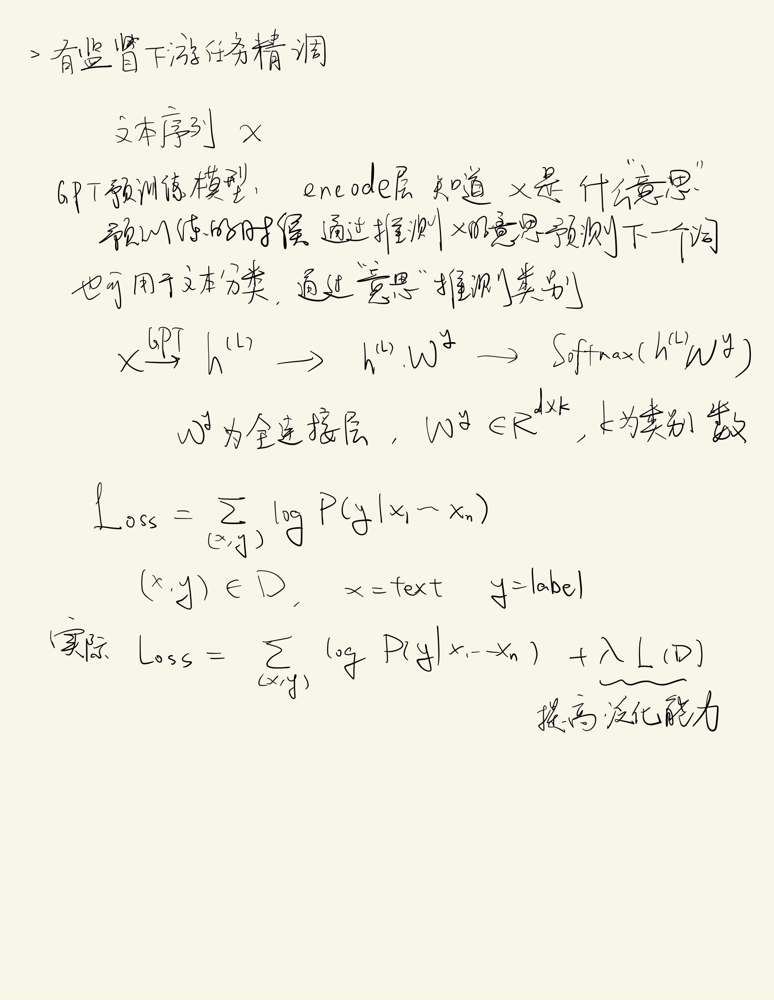

Introduction to NLP book note

Nemo

# chap 1: introduction

## nlp主要难点：歧义性或多义性（Ambiguity）
- 语音歧义：“flower”和“flour”的发音相同，“see（看见）与sea（大海）”、“son（太阳）与sun（儿子）”等
- 词语切分歧义：e.g.这门语言学起来很困难。
- 词义歧义：比如中文的打，有许多意思
- 结构歧义：反对的是少数人
- 指代和省略歧义：
  - 指代歧义：猴子吃了香蕉，因为它饿了。（这里的“它”）
  - 省略歧义：县政府同意乡政府报告。
- 语用歧义：女子致电男友：地铁站见。如果你到了我还没到，你就等着吧。如果我到了你还没到，你就等着吧！！

## 自然语言处理的基本范式
### 基于规则的方法

### 基于机器学习的方法

通常分为四个步骤：数据构建、数据预处理、特征构建以及模
型学习

### 基于深度学习的方法
通常仅包含数据构建、数据预处理和模型学习三个部分，把特征构建的工作交给了深度学习模型自己去做。

### 基于大模型的方法

# chap 2: 词汇分析
## 语言中的词汇
词通常是由语素（Morpheme）构成。

语素又称词素，是语言中意义的最小单元。语素与词不同，语素不能够独立运用而词可以。

只包含一个语素的词语称为简单词（Simple word），而包含多个语素的词称为复杂词（Complex word）。例如：“电灯”，包含“电”和“灯”两个语素。

此外，根据词在语言中的用途的不同，词还可以被划分为实义词（Content words）和功能词（Function words）。

实义词包含事物、行为、属性和观念等概念。功能词则是指没有清楚词汇意义或与之有关的明显概念的词。

### 词的形态学
语素主要分成两类: 词根（Lemma）和词缀（Affix）
unhappy, un-是词缀，happy是词根

### 词的词性
词性就是词的分类。

现在语言学中一个重要的词的分类是区分实义词（ContentWords）和功能词（FunctionWords）

实义词表达具体的意义

实义词主要包含名词、动词、形容词等。

功能词则主要是为了满足语法功能需求。

功能词主要包含代词、冠词、指示词等。

## 词语规范化

### 词语切分
将句子切分为单词序列

词语切分任务可以定义为：给定一个符号串x = c1c2 ···cn, （其中ci 对于英文来说是字母、数字、标点符号等，对于中文来说是汉字、数字、标点符号等），输出一个词形（Token）序列y = t1t2 ···tm，可能会省略或删除其中的部分标点符号。

通常情况下针对英语等印欧语系语言的词语切分任务可以采用基于有限状态自动机（Finite State Automata）融合正则表达式的方法完成。

对汉语、日语、阿拉伯语等词语中间没有分隔符的语言，词语切分问题更加复杂

### 词形还原
词形还原（Lemmatization）是将词的各种变化形式还原其词根的过程。通过词形还原可以实现词语的规范化，单词的不同变化形式统一为词根。

典型的词形分析算法包括基于有限状态转换机（Finite State Transducer）方法，融合词典和有限状态转换机的方法以及统计机器学习方法等

### 词干提取
后缀剥离（Suffix-stripping）

后缀替代（Suffix Substitution）

## 中文分词
中文分词任务可以形式化表示为：输入中文句子c1c2 ···cn，其中ci 为单个字符，输出词序列w1w2 ···wm, 其中wj 是中文单词。

中文分词有以下三个困难：
### 分词规范
分词规范不同

### 切分歧义

常汉语中常见的切分歧义可以归纳为三类：交集型切分歧义、组合型切分歧义和真歧义

#### 交集型切分歧义

交集型切分歧义也被称为偶发歧义，当两个有交集的词“偶然”的相邻出现时这样的歧义才会发生。

#### 组合型切分歧义
组合型切分歧义是指如果汉字串AB，满足A，B，AB同时为词

比如“才”“能”“才能”

#### 真歧义

汉字串 ABC 满足多种切分方式下语法和语义均没有问题, 只有通过上下文环境才能给出正确的切分结果，则汉字串ABC 被称为真歧义

### 未登录词识别
未登录词就是生词，是指在训练语料中没有出现或者词典当中没有，但是在测试数据中出现的词。

- 新出现的普通词汇
- 人名、地名、时间等
- 专业名词
- 其他专有名词

## 中文分词方法
### 基于最大匹配的中文分词方法
最大匹配（Maximum Matching）分词算法主要包含前向最大匹配，后向最大匹配以及双向最大匹配等三类。

前向最大匹配：从左向右扫描，对于某个位置，找到词典中最长的匹配

后向最大匹配和正向最大匹配思想相同，区别在于对句子从右向左扫描。

双向最大匹配则是同时进行前向最大匹配和反向最大匹配，当两者的分词结果不同时，可以使用启发式的规则决定选取哪一个结果作为最终的输出（例如选择平均词长较大的一个）。

### 基于线性链条件随机场的中文分词方法
将分词过程看做是对于字的分类。

具体来说，对于输入句子中的每一个字ci，根据它在分词结果中的位置赋予不同的标签。可以假设一个字在词语中有四个位置：开始（B）、中间（I）、结尾（E）以及单独成词（S）。BIES标签

即将分词过程转化为给字贴BIES标签的过程。

条件随机场（Conditional Random Field，CRF）试图对多个变量在给定观测值后的条件概率进行建模。

x = {x1,x2,...,xn}为观测序列，y = {y1,y2,...,yn}为对应的标记序列，条件随机场的目标是构建条件概率P(y|x) 模型。

在中文分词任务中，观察序列x 对应输入的字序列{c1,c2,··· ,cn}，标记序列为每个字对应的BIES 标签。

关键是设计有效的特征函数。

### 基于感知器的中文分词方法

GEN(X)表示输入字序列x所有的候选输出序列，y为输出词序列

将y定义为一个d维向量，模型参数为α，根据α选出最优的y

由于不可能枚举所有的候选输出序列，所以常采用集束搜索（Beam Search）的方法来选取最优的输出序列。即将y的输出设为很多步，每一步都用score函数计算出最优的k项解，然后将这k项解作为下一步的输入，直到最后一步。它并不能保证整体最优。

模型参数α的学习可以使用感知器算法，即在每一步中，如果预测的输出与真实输出不一致，则更新模型参数α。

### 基于双向长短期记忆网络的中文分词方法
长短期记忆网络（Long Short-Term Memory, LSTM） 是循环神经网络的一个变体，可以在一定程度上缓解简单循环神经网络的梯度消失和梯度爆炸问题。

## 中文分词评价方法

通常F 值计算时设置β 为1，因此F 值又称为F1 值。

中文分词中额外引入一项新的指标Roov

此外，由于有些中文分词算法会利用词典、无标注数据等除训练数据外的资源，为了能够更好地对模型本身的效果进行评价，评测有时还会区分封闭测试（Closed Test）和开放测试（Open Test）。封闭测试仅允许使用给定的训练语料，而开放测试可以使用任意资源。

## 中文分词语料库

## 词性标注
词性标注（Part-of-speech Tagging，POS Tagging）是指在给定的语境中确定句子中各词的词性

### 基于规则的词性标注
brill tagger

### 基于HMM模型的词性标注
pass

### 基于卷积神经网络的词性标注
pass

## 词性标注评价方法

## 词性标注语料库

# chap 4
## 词汇语义学
### 词汇语义理论
#### 语义场理论
语义场理论（Semantic Field Theory），也叫词义场理论（Theory of Lexical Field）认为语言中词汇的意义是相互联系的，构成一个完整的系统和网络，具有某些相同语义特征的一组词聚而成场

如表示苹果、香蕉、橘子等都有一个共同的义素[+ 水果]，组成了语义场中的“水果场”（Fruit Field ）。水果、肉、蔬菜、谷物等又可以构成食物语义场

根据语义场理论，不能够孤立地研究一个词的词义，只有通过分析比较词与词之间的关系，才能确定一个词的真正意义。除了词汇的上下位关系外，同义关系、反义关系等都构成语义场。因此，语义场也可以认为是研究词与词之间的聚合关系（Paradigmatic Relation）

#### 语义成分分析理论
词义可以由最小的语义成分组合而成。这种最小的语义成分又被成为语义特征。

#### 义元理论
自然语言中包含非常少部分的词语，这些词语可以用于解释绝大部分词汇的意义。这些语义上不能分解的最小的意义组成单元称为义元（Lexical Primitives）

> 语义成分分析是组合，义元是解释

#### 框架语义学
词义只能在相应的知识框架背景中才能得到理解。在意义的理解过程中，概念并不是杂乱无章的，很多概念往往具有一种同现的趋势，例如：顾客、服务员、吃饭、账单等概念都与饭店相关，是理解“饭店”的框架。此外，在意义的理解过程中，并不一定需要激活一个语义框架的全部成分，往往只需要激活部分框架。

比如可以对risk单词构建一个框架

对于包含risk的句子，可以根据risk框架进行理解

### 词汇间的关系
关系类型可以分为三大类：形体关系、意义关系和实体关系

形体关系（Form Relations）主要研究词汇的发音、词形和拼写之间的关系。

意义关系（Sense Relations）主要关注词汇意义之间的关联性、相似性、对立性等关系。

实体关系（Object Relations）则主要研究词汇之间的客观关系。

WordNet: 目前最常用的英语词汇知识资源库

其中词汇按照义项组合成同义集（Synset），每个义项表达不同的概念。名词、动词、形容词和副词各自独立地组合成网络。WordNet 的语义关系不是在单词之间建立的，而是在义项之间建立的。义项之间的关系包括：同义关系、反义关系（Inconsistency）、上下位关系、部分与整体关系、对等关系（Coordinate terms）、蕴含关系(Entailment) 等类型。WordNet 3.1 版本包含155327 个单词，175979 个同义集，共组成了207016 对单词和义项对

## 分布式表示
分布式表示（Distributed Representation）旨在将文本表示为低维空间下稠密的向量，并在低维表示空间中利用表示向量之间的计算关系，体现文本间的语义关联。

在分布式表示提出之前，许多自然语言处理算法采用独热表示（One-hot Rep-resentation），其中每个维度表示某个单词是否在该文中出现。独热表示的维度和词表的大小一致，存在表示稀疏性的问题，而且无法表示单词之间的语义相似度。

布式表示通过将文本表示为低维空间下稠密的向量，有效地解决了这一问题。

### 单词分布式表示
形式上，单词分布式表示的目标是建立单词嵌入矩阵W∈R|V|∗d，其中矩阵的每一行对应一个单词，为单词的向量表示，即词向量。

根据单词分布式表示的目标，即在向量空间建构单词之间的语义关联，使含义相近的单词具有相似的向量表示。

#### 基于共现矩阵奇异值分解的词向量模型

共现矩阵的每一行可以自然地当做对应词的向量表示，因为它的不同维度表示和各个单词的共现次数，共现矩阵提供的向量表示可以体现词语之间的相似度。然而，共现矩阵提供的词向量表示维度和词表大小相同，依然面临表示稀疏性的问题。

奇异值分解方法将共现矩阵分解为低阶近似矩阵，从而为每个单词提供低维表示。

一般情况下，矩阵奇异值的大小分布极不均匀，前10% 奇异值之和可以占到全部奇异值之和的90% 以上。因此，可以在奇异值矩阵中只保留最大的d 个奇异值，同时在两侧矩阵中仅保留对应的分量，对矩阵A 进行低秩近似。应用上述方法，对于共现矩阵进行数据压缩，就可以获得单词的低维稠密表示W ∈R|V|×d，目的是使WiW Tj 能够近似地还原词表中下标为i,j 的单词在相同上下文中出现的频率。

#### 基于上下文单词预测词向量模型
Word2Vec  
构建了两个非常简单的神经网络模型结构：连续词袋模型（Continuous Bag Of Words，CBOW）和跳字模型（Skip-Gram，SG），用于学习单词分布式表示。

##### skip-gram
Skip-Gram 模型的基本假设是文本中的词可以预测其上下文窗口内的其他词。如图4.4所示，在句子“我稍后回答这个问题”中，对于中心词“回答”，当以大小为2 的上下文窗口预测时，模型考虑上下文窗口内词语“我”，“稍后”。“这个”，“问题”在中心词为“回答”条件下的出现概率。Skip-Gram 模型通过最大化上下文词在给定中心词时的条件概率，来进行模型的训练。

也就是说，skip-gram的目的是构建词表（词嵌入矩阵），词嵌入矩阵--->概率--->损失函数，通过最小化损失函数得到最优的词嵌入矩阵

skip-gram模型通常采用中心此表作为最终的词向量表

##### CBoW
CBoW 模型则假设文本中的词可以通过其在文本中的上下文词推导出来。在句子“我稍后回答这个问题”中，当以大小为2 的上下文窗口预测中心词“回答”时，模型仅考虑上下文词“我”，“稍后”,“这个”，“问题”，以此推断中心词的出现概率。CBoW 模型通过最大化中心词在上下文中出现的条件概率，来进行模型的训练。

##### 优化
在实际应用中，由于词表内通常包含数万甚至数十万单词，Skip-Gram 和CBoW 模型在基于Softmax 计算上下文词和中心词的出现概率进行梯度更新时，会产生非常大规模的计算开销。因此，通常使用负采样或者层次Softmax 的方法降低计算开销。

###### 负采样

###### 层次softmax

##### GLOVE && review note
 

 

 

##### 基于字节对编码的子词表示模型
子词：为了缓解未登录问题

子词表示模型会维护一个子词词表，其中既存在完整的单词，也存在形如“c”, “re”, “ing”等单词部分信息，称为子词。子词表示模型对词表中的每个子词计算一个定长向量表示，供下游模型使用。

对于输入的词序列，子词表示模型将每个词拆分为词表内的子词。例如，将单词“reborn”拆分为“re”和“born”。

模型随后查询每个子词的表示，将输入重新组成为子词表示序列。

当下游模型需要计算一个单词或词组的表示时，可以将对应范围内的子词表示合成为需要的表示。

因此，子词表示模型能够较好地解决自然语言处理系统中未登录词的问题。

字节对编码模型（Byte Pair Encoding，BPE）是一种常见的子词表示模型。该模型所采用的词表包含最常见的单词以及高频出现的子词。

在使用中，常见词通常本身位于BPE 词表中，而罕见词通常能被分解为若干个包含在BPE 词表中的子词，从而大幅度降低未登录词的比例。

BPE算法包括两个部分：（1）子词词表的确定；（2）全词切分为子词以及子词合并为全词的方法。

###### 子词词表的确定

##### 单词分布式表示的评价与应用
根据评测基准和余弦相似度的比较

# chap 6
## 语言模型概述

语言模型的训练过程虽然采用的有监督方法，但是由于训练目标可以通过原始文本直接获得，从而使得模型的训练仅需要大规模无标注文本即可。语言模型也成为了典型的自监督学习（Self-supervised Learning）任务。

## n元语言模型
最大似然估计：

C表示在训练语料中词序列出现的频次

但是随着词序列长度的增长，C可能为0

解决办法是假设单词wi的出现的概率只与过去的n-1个词相关，这样的模型被称为n 元语法或n 元文法(n-gram) 模型。

其中 n-gram 表示由 n 个连续单词构成的单元，也被称为n 元语法单元。n 的取值越大，其历史信息越完整，但参数量也会随之增大。

实际应用中，n 的取值通常小于等于4。

通常在句首加上`<BOS>`，在句尾加上`<EOS>`

但是再庞大的训练语料也无法覆盖所有情况（因为语言是不断被创造和发展的），所以肯定会出现0概率问题

解决方式是平滑：即产生更加合理的概率，而不是直接用频率

### 加法平滑
加法平滑（Additive Smoothing）是实际运用中最常用的平滑技术之一。

其思想是假设事件出现的次数比实际出现的次数多δ 次。

## 神经网络语言模型
随着深度神经网络的发展，利用神经网络的语言模型展现出了比n 元语言模型更强的学习能力。神经网络先进的结构使其能有效的建模长距离上下文依赖，以词向量（Word Embedding）为代表的分布式表示的语言模型深刻地影响了自然语言处理领域的其他模型与应用的变革 。因此，n 元语言模型几乎已经被神经网络的语言模型所替代。本节将介绍如何使用经典的前馈神经网络和循环神经网络来建模语言模型。

### 前馈神经网络语言模型

前馈神经网络由三部分组成，如图6.1所示，分别为输入层、隐藏层和输出层。

历史词序列首先经过输入层被转换为离散的独热编码，随后每个词的独热编码被映射为一个低维稠密的实数向量；

隐藏层对词向量层的输出进行编码，进行多次线性变换与非线性映射；

最后，隐藏层向量经过输出层被映射到词表空间，再利用Softmax 函数得到其词表上的概率分布。
 

### 循环神经网络语言模型

模型需要获取“小明”这一信息才能对“他”进行准确的预测。而这两个词语之间的距离接近15个单词，如果采用前馈神经网络，需要的历史词长度过长。

循环神经网络（Recurrent Neural Network, RNN）常用于处理序列结构的数据。

其特点是上一时刻的模型隐藏层状态会作为当前时刻模型的输入，每一时刻的隐藏层状态都会维护所有过去词的信息。

循环神经网络语言模型不再基于马尔可夫假设，每个时刻的单词都会考虑到过去所有时刻的单词，词之间的依赖通过隐藏层状态来获取，这刚好解决了语言模型需要动态依赖的问题。

与前馈神经网络语言模型类似，循环神经网络语言模型由三部分组成：输入层、隐藏层和输出层。

 

## 预训练语言模型

### 动态词向量算法ELMo
之前由单词的分布式表示得到的词向量表是静态的，即在训练过程词向量表是不发生改变的。

然而，自然语言中词语往往具有多种语义，在不同的上下文或语境下会具有不同的语义。针对该问题，研究人员们提出了动态词向量（Dynamic Word Embedding），也称为上下文相关的词向量（Contextualized Word Embedding）方法，一个词语的向量通过其所在的上下文计算获得，跟随上下文动态变化。

双向预训练语言模型 ELMo（Embeddings from Language Models）

为了减少词不再词表中的情况，对输入文本采用字符级编码

...

预训练：取最高层的正向和反向LSTM输出来预测下一时刻的词，训练优化模型参数

双向LSTM保证在一个位置能获取来自过去和来自未来的信息（前向获取来自过去的信息；后向获取来自未来的信息）

也就是说，如果有L层双向LSTM层，那么给定词wi，会获取2L+1个词向量：vi为输入层编码的词向量，L个前向LSTM层编码得到的词向量，L个后向LSTM层编码得到的词向量。

最终将得到的2L+1个词向量进行组合，得到wi的最终表示向量，再进行后续的分类任务等等。
 
 

### 生成式预训练语言模型GPT

GPT 模型结构如图所示，由多层Transformer 组成的单向语言模型，主要可以分为输入层，编码层和输出层三部分。

#### 无监督预训练
GPT 采用生成式预训练方法，单向意味着模型只能从左到右或从右到左对文本序列建模（生成式都是生成下一时刻的信息），所采用的Transformer 结构和解码策略保证了输入文本每个位置只能依赖过去时刻的信息。

 

### 掩码预训练语言模型bert

 
 

### 序列到序列预训练语言模型 BART
BART 模型也是使用基于Transformer 的序列到序列结构。

相较于标准的Transformer，BART 选择了GeLU 而不是ReLU 作为激活函数，并且使用了正态分布N(0,0.02) 进行初始化。

Transformer编码器具备双向编码上下文信息的能力，单向的Transformer 解码器又满足生成任务的需求。

#### 预训练
采用的是对含有噪声的输入文本进行去噪重构方法，属于去噪自编码器（Denoising Autoencoder）。

bart引入噪声的5种方法：

### 预训练语言模型的应用
__在预训练阶段，大规模的数据使预训练语言模型有效地学习到了语言的通用语义表示，微调（Fine-tuning）则是利用预训练语言模型的主要范式，其目的是基于学习到的通用表示，针对目标领域的特性对模型进行调整，使其更适合下游任务。__

#### 分类任务
微调模型以及后面的分类矩阵即可

#### 序列标注
序列标注任务需要解决的是字符级别的分类问题，其应用范围非常广泛，可用于分词，词性标注和命名实体识别等自然语言处理基础任务。以命名实体识别为例，在用序列标注的形式完成该任务时，需要对输入文本中的每一个词预测一个相应的标签，再根据整个序列的标签抽取出句子中的实体词。

## 大规模语言模型
三个过程：
第一个阶段是基础大模型训练，该阶段主要完成长距离语言模型的预训练，通过代码预训练使得模型具备代码生成的能力；

第二阶段是指令微调（Instruct Tuning），通过给定指令进行微调的方式使得模型具备完成各类任务的能力；

第三个阶段是类人对齐，加入更多人工提示词，并利用有监督微调并结合基于强化学习的方式，使得模型输出更贴合人类需求。

### 并行分布式计算
数据并行

张量并行

流水线并行

### 指令微调
将大量各类型任务，统一为生成式自然语言理解框架，并构造训练语料进行微调。

可以将情感倾向分析任务，通过如下指令，将贬义和褒义的分类问题转换到生成式自然语言理解框架：

### 类人对齐
由于自然语言处理语料集合中所包含的答案，通常都是简短的标签，基本没有类似人类回答的有监督数据。

如果全部使用人工，将自然语言处理任务数据集进行改造，构造类似人工回答的训练语料，所需要的规模过于庞大，时间成本和人工成本都过于高昂。

Open AI提出了使用基于人类反馈的强化学习方法（Reinforcement Learning from Human Feedback，RLHF），大幅度降低了数据集构建成本

RLHF 算法主要分为如下三个步骤：
1. 收集初始数据初步训练大模型，从得的指令集合中采样部分数据，对初始的大模型进行有监督微调；
2. 收集打分数据并训练奖励（Reward）函数，使用无标注的指令数据，收集模型的多个输出结果，评价人员根据模型的输出结果进行对比评价，确定模型输出的结果排序，并利用该评分训练奖励函数，使其未来可以对模型输出的优劣进行判断；
3. 使用更多的指令数据，利用奖励函数输出的得分，利用强化学习机制根据奖励得分进一步优化大模型。

重点应该是训练出来了奖励函数来代替人工评分

## 语言模型的评价
语言模型最直接的测评方法就是使用模型计算测试集的概率，或者利用交叉熵（Cross-entropy）和困惑度（Perplexity）等派生测度。