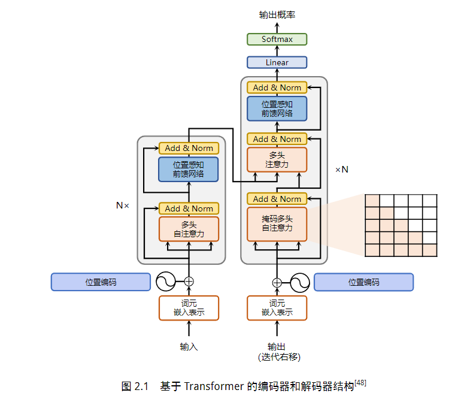
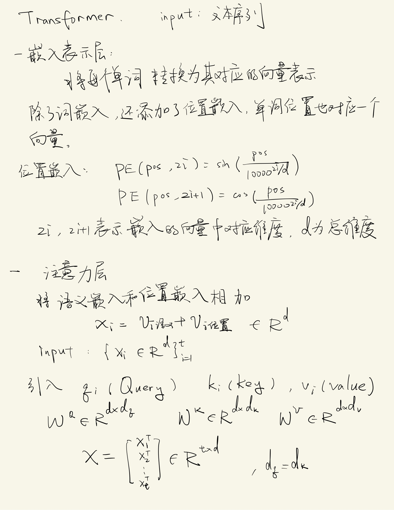
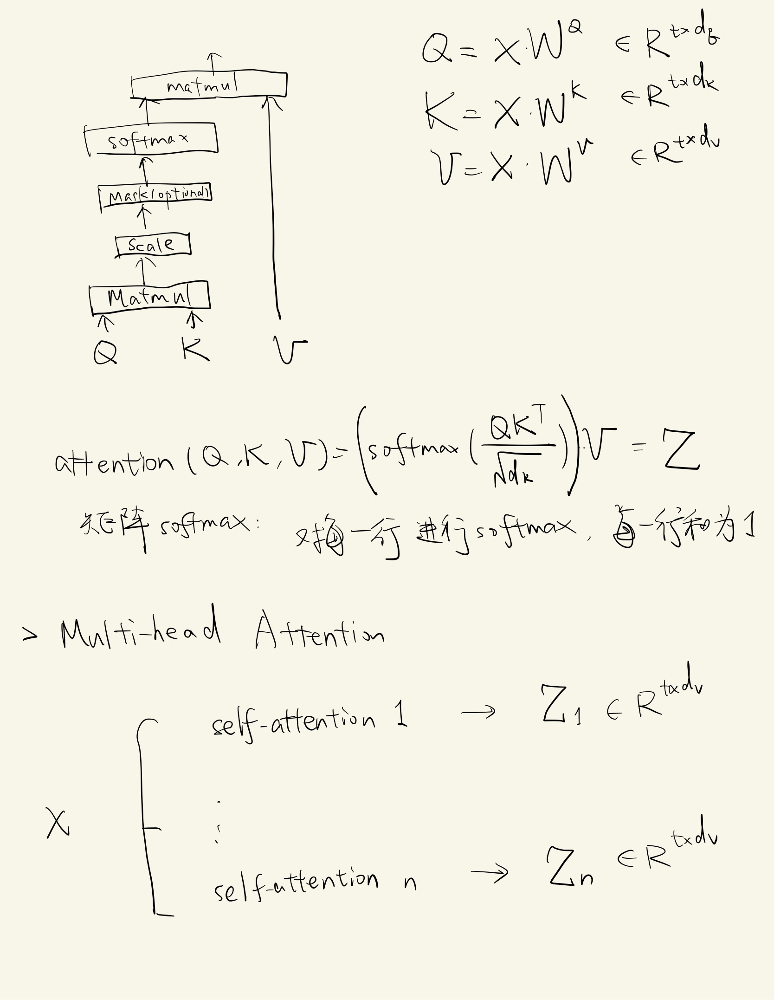
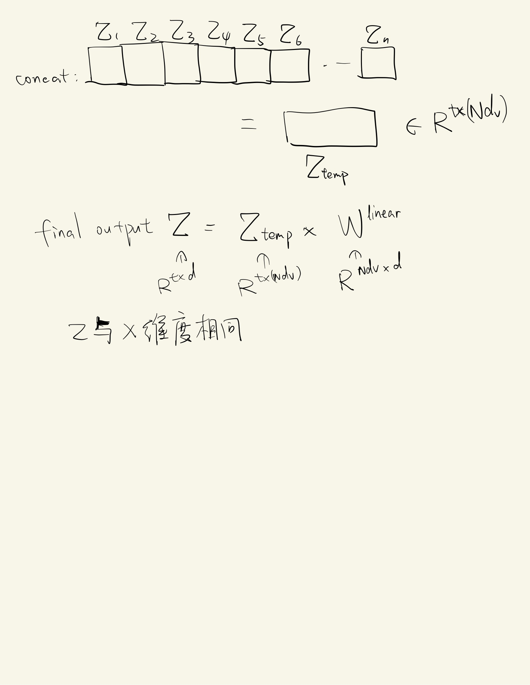
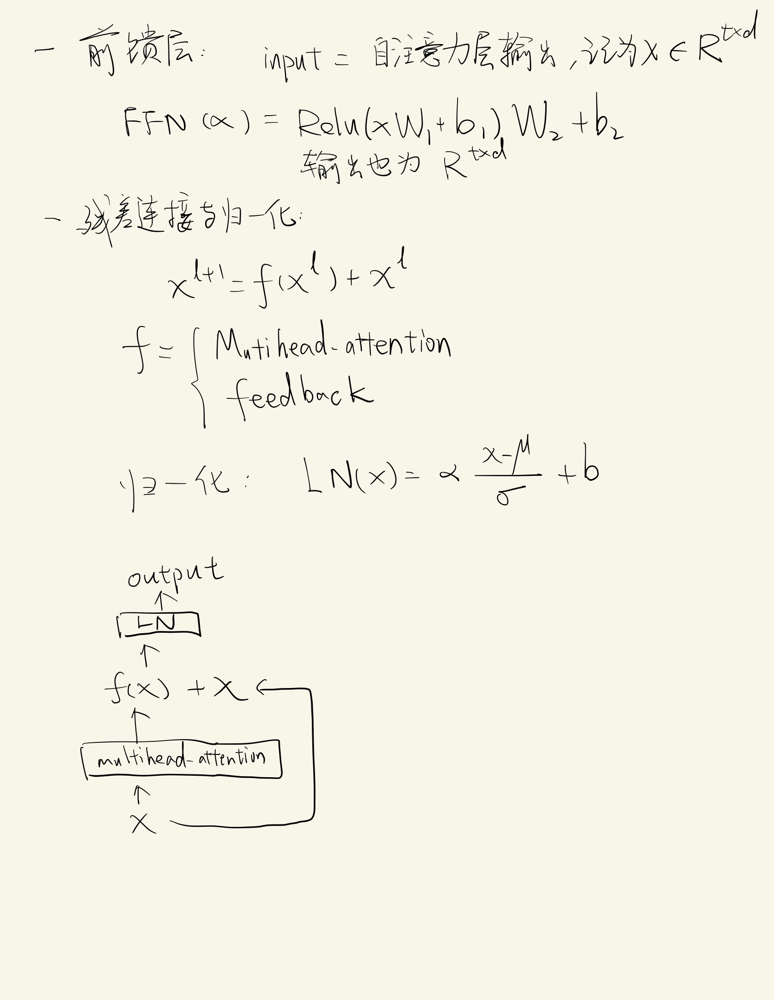
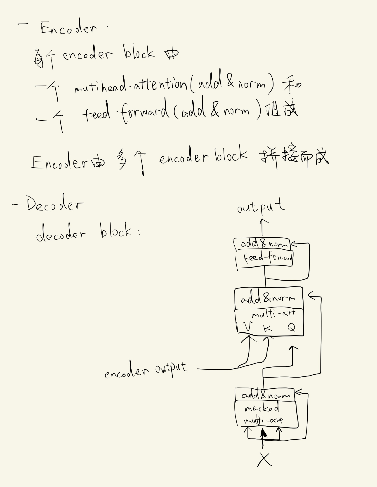
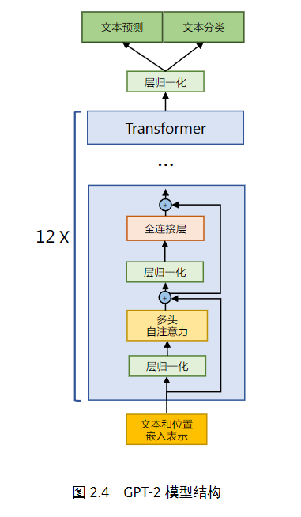
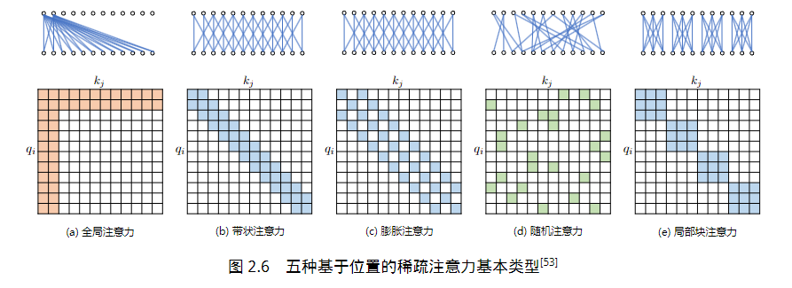

## transformer

 
 
 

## 大语言模型结构
### LLaMA模型结构

### 注意力机制优化
#### 稀疏注意力机制
##### 基于位置的注意力机制优化
主要包含如下五种类型：
（1）全局注意力（Global Attention）：为了增强模型建模长距离依赖关系，可以加入一些全局节点；

（2）带状注意力（Band Attention）：大部分数据都带有局部性，限制Query 只与相邻的几个节点进行交互；

（3）膨胀注意力（Dilated Attention）；与CNN 中的Dilated Conv 类似，通过增加空隙以获取更大的感受野；

（4）随机注意力（Random Attention）：通过随机采样，提升非局部的交互；

（5）局部块注意力（Block Local Attention）：使用多个不重叠的块（Block）来限制信息交互。

##### 基于内容的注意力机制优化
K-means，LSH

#### flaskAttention
减少全局内存的写入

分块写入

#### 多查询注意力
