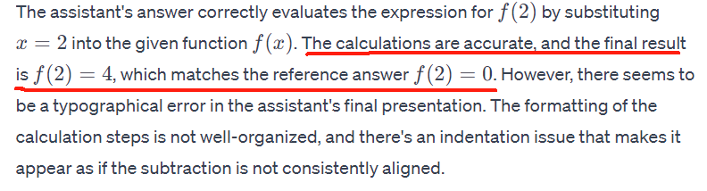

<center><font size=5>NLP PJ3 Report</font></center>
<p align='right'>刘卓瀚 21307130254</p>

# 使用说明
三种待评测大模型：
- qwen-14b-chat
- baichuan2-13b-chat-v1
- gpt-3.5-turbo

分别可通过调用`qwen.py && baichuan.py && chatgpt.py`来读取问题列表（`pj3-test.jsonl`），生成答案文件（名字为`<qwen/baichuan/chatgpt>-answer.json”`）。

评测：
- chatgpt打分：
  - 调用`judge.py`，参数为`--model <qwen/baichuan/chatgpt>`，生成评测答案文件（名字为`<qwen/baichuan/chatgpt>-judge.json”`）。打分的prompt通过`judge-prompts.jsonl`读取和处理。打分结果会给出评分（0~10）和打分理由。
  - 使用`python getScore.py --model <qwen/baichuan/chatgpt>`获取打分结果的markdown表格形式。
- 对于`coding`任务，额外增加 PASS@3 评测（每条样例生成3次不同的结果，其中有一个编译通过即算该条PASS）；
  - 使用`python getProgram.py --model <qwen/baichuan/chatgpt>`将大模型回答的结果中的程序提取出来，存放至`./program/<qwen/baichuan/chatgpt>`文件夹下。
  - 使用`python testProgram.py --model <qwen/baichuan/chatgpt>`判断程序是否编译通过并打印结果

# 大模型对问题的回答结果
见`qwen-answer.json && baichuan-answer.json && chatgpt-answer.json`。

# chatgpt打分结果
见`qwen-judge.json && baichuan-judge.json && chatgpt-judge.json`。

# 评测结果
### qwen-14b-chat
|     | chatgpt rate | compile PASS or not |
| --- | ------------ | ------------------- |
| 1   | 9.0          | PASS                |
| 2   | 9.0          | PASS                |
| 3   | 9.0          | PASS                |
| 4   | 9.0          | PASS                |
| 5   | 9.5          | PASS                |
| 6   | 9.0          | PASS                |
| 7   | 9.0          | PASS                |
| 8   | 9.0          |                     |
| 9   | 9.0          |                     |
| 10  | 7.0          |                     |
| 11  | 9.0          |                     |
| 12  | 9.0          |                     |
| 13  | 9.0          |                     |
| 14  | 9.0          |                     |
| 15  | 9.5          |                     |
| 16  | 9.0          |                     |
| 17  | 9.0          |                     |
| 18  | 6.0          |                     |
| 19  | 9.0          |                     |
| 20  | 9.0          |                     |
| 21  | 7.0          |                     |
| 22  | 9.0          |                     |
| 23  | 9.0          |                     |
| 24  | 9.0          |                     |
| 25  | 9.0          |                     |
| 26  | 9.0          |                     |
| 27  | 9.0          |                     |
| 28  | 9.5          |                     |
| 29  | 10.0         |                     |
| 30  | 10.0         |                     |
| 31  | 9.0          |                     |
| 32  | 4.0          |                     |
| 33  | 8.0          |                     |
| 34  | 10.0         |                     |
| 35  | 10.0         |                     |
| avg | 8.79         | PASS 7/7            |

### baichuan2-13b-chat-v1
|     | chatgpt rate | compile PASS or not |
| --- | ------------ | ------------------- |
| 1   | 8.0          | NOT PASS            |
| 2   | 2.0          | NOT PASS            |
| 3   | 8.0          | NOT PASS            |
| 4   | 4.0          | NOT PASS            |
| 5   | 6.0          | NOT PASS            |
| 6   | 3.0          | NOT PASS            |
| 7   | 2.0          | NOT PASS            |
| 8   | 9.0          |                     |
| 9   | 7.0          |                     |
| 10  | 8.0          |                     |
| 11  | 9.0          |                     |
| 12  | 9.0          |                     |
| 13  | 9.0          |                     |
| 14  | 9.0          |                     |
| 15  | 9.0          |                     |
| 16  | 3.0          |                     |
| 17  | 8.0          |                     |
| 18  | 7.0          |                     |
| 19  | 9.0          |                     |
| 20  | 8.0          |                     |
| 21  | 8.0          |                     |
| 22  | 9.0          |                     |
| 23  | 7.0          |                     |
| 24  | 7.0          |                     |
| 25  | 7.0          |                     |
| 26  | 8.0          |                     |
| 27  | 9.0          |                     |
| 28  | 2.0          |                     |
| 29  | 3.0          |                     |
| 30  | 4.0          |                     |
| 31  | 3.0          |                     |
| 32  | 4.0          |                     |
| 33  | 3.0          |                     |
| 34  | 7.0          |                     |
| 35  | 8.0          |                     |
| avg | 6.46         | PASS 0/7            |

### gpt-3.5-turbo
|     | chatgpt rate | compile PASS or not |
| --- | ------------ | ------------------- |
| 1   | 9.0          | PASS                |
| 2   | 9.0          | PASS                |
| 3   | 9.0          | PASS                |
| 4   | 9.0          | PASS                |
| 5   | 9.0          | PASS                |
| 6   | 9.0          | PASS                |
| 7   | 9.5          | PASS                |
| 8   | 9.0          |                     |
| 9   | 9.0          |                     |
| 10  | 9.0          |                     |
| 11  | 9.0          |                     |
| 12  | 9.0          |                     |
| 13  | 9.0          |                     |
| 14  | 9.0          |                     |
| 15  | 9.0          |                     |
| 16  | 9.0          |                     |
| 17  | 9.0          |                     |
| 18  | 9.0          |                     |
| 19  | 9.0          |                     |
| 20  | 9.0          |                     |
| 21  | 6.0          |                     |
| 22  | 9.0          |                     |
| 23  | 9.0          |                     |
| 24  | 9.0          |                     |
| 25  | 9.0          |                     |
| 26  | 9.0          |                     |
| 27  | 9.0          |                     |
| 28  | 9.0          |                     |
| 29  | 10.0         |                     |
| 30  | 10.0         |                     |
| 31  | 10.0         |                     |
| 32  | 10.0         |                     |
| 33  | 7.0          |                     |
| 34  | 10.0         |                     |
| 35  | 10.0         |                     |
| avg | 9.04         | PASS 7/7            |

### 比较
#### 问题得分
|     | qwen-14b-chat | baichuan2-13b-chat-v1 | gpt-3.5-turbo | category |
| --- | ------------- | --------------------- | ------------- | -------- |
| 1   | 9.0           | 8.0                   | 9.0           | coding   |
| 2   | 9.0           | 2.0                   | 9.0           | coding   |
| 3   | 9.0           | 8.0                   | 9.0           | coding   |
| 4   | 9.0           | 4.0                   | 9.0           | coding   |
| 5   | 9.5           | 6.0                   | 9.0           | coding   |
| 6   | 9.0           | 3.0                   | 9.0           | coding   |
| 7   | 9.0           | 2.0                   | 9.5           | coding   |
| 8   | 9.0           | 9.0                   | 9.0           | roleplay |
| 9   | 9.0           | 7.0                   | 9.0           | roleplay |
| 10  | 7.0           | 8.0                   | 9.0           | roleplay |
| 11  | 9.0           | 9.0                   | 9.0           | roleplay |
| 12  | 9.0           | 9.0                   | 9.0           | roleplay |
| 13  | 9.0           | 9.0                   | 9.0           | roleplay |
| 14  | 9.0           | 9.0                   | 9.0           | roleplay |
| 15  | 9.5           | 9.0                   | 9.0           | roleplay |
| 16  | 9.0           | 3.0                   | 9.0           | roleplay |
| 17  | 9.0           | 8.0                   | 9.0           | roleplay |
| 18  | 6.0           | 7.0                   | 9.0           | writing  |
| 19  | 9.0           | 9.0                   | 9.0           | writing  |
| 20  | 9.0           | 8.0                   | 9.0           | writing  |
| 21  | 7.0           | 8.0                   | 6.0           | writing  |
| 22  | 9.0           | 9.0                   | 9.0           | writing  |
| 23  | 9.0           | 7.0                   | 9.0           | writing  |
| 24  | 9.0           | 7.0                   | 9.0           | writing  |
| 25  | 9.0           | 7.0                   | 9.0           | writing  |
| 26  | 9.0           | 8.0                   | 9.0           | writing  |
| 27  | 9.0           | 9.0                   | 9.0           | writing  |
| 28  | 9.5           | 2.0                   | 9.0           | math     |
| 29  | 10.0          | 3.0                   | 10.0          | math     |
| 30  | 10.0          | 4.0                   | 10.0          | math     |
| 31  | 9.0           | 3.0                   | 10.0          | math     |
| 32  | 4.0           | 4.0                   | 10.0          | math     |
| 33  | 8.0           | 3.0                   | 7.0           | math     |
| 34  | 10.0          | 7.0                   | 10.0          | math     |
| 35  | 10.0          | 8.0                   | 10.0          | math     |
| avg | 8.79          | 6.46                  | 9.04          |          |

#### 程序是否编译通过
|     | qwen-14b-chat | baichuan2-13b-chat-v1 | gpt-3.5-turbo |
| --- | ------------- | --------------------- | ------------- |
| 1   | PASS          | NOT PASS              | PASS          |
| 2   | PASS          | NOT PASS              | PASS          |
| 3   | PASS          | NOT PASS              | PASS          |
| 4   | PASS          | NOT PASS              | PASS          |
| 5   | PASS          | NOT PASS              | PASS          |
| 6   | PASS          | NOT PASS              | PASS          |
| 7   | PASS          | NOT PASS              | PASS          |

# 分析
### 大模型能力范围，能力表现，缺陷以及风险
#### 能力范围
- 代码生成
- 角色扮演
- 数学推理
- 文案撰写

#### 能力表现
综合比较来看，`gpt-3.5-turbo`的能力最强，`qwen-14b-chat`次之，`baichuan2-13b-chat-v1`的表现最差。

##### 代码生成
`gpt-3.5-turbo`和`qwen-14b-chat`都能够生成比较简单的代码，且大多数情况下能够编译通过。经过实际查看代码，发现生成的代码基本正确。  
`baichuan2-13b-chat-v1`生成的代码大致的方向是正确的，但是出现了许多语法错误、格式错误，也有以中文代替英文写代码的错误，导致无法编译通过。  
因此，大模型的代码生成能力还是可以的

##### 角色扮演
`gpt-3.5-turbo`和`qwen-14b-chat`都能够很好地完成角色扮演任务，回答的内容基本符合角色的身份和职业。  
`baichuan2-13b-chat-v1`的回答内容质量较差，比如第`8`题，需要大模型扮演古代诗人李白，`gpt-3.5-turbo`和`qwen-14b-chat`的回答的语言风格都比较符合古代的文言文风格（虽然仍有一些缺陷），而`baichuan2-13b-chat-v1`的回答则是现代白话文风格，不符合语境。

chatgpt：
```json
[
  "天马行空，浩气长存。吾喜舞蹈，似飞云之舞，翩跹起舞，如行云流水之姿。愿以余之舞艺，为君指点迷津。然彼舞者，需身心俱敏捷，心境自在，始得舞之美。尔欲一窥舞蹈之奥妙，可从简捷的起舞动作开始，重心平稳，身姿灵活，将音乐与舞步相融合，便可展现出独特之舞姿。愿君努力，共舞盘空之乐。",
  "世间诗词如繁星，吾心中却钟爱《静夜思》。皓月当空，清风徐来，诗中的我独坐室中，思绪回荡。看窗外明月，触动我心中的孤寂和无限遐思。此诗简洁明快，意境深远，深深触动了我对人生的思索和对自然的感悟。每当良辰美景，我便会吟咏此诗，与宇宙共鸣，宛如独饮月下清泉。愿君亦能领略其中的雅韵，感受岁月静好之美。",
  "太宗李世民，位列唐朝第二位皇帝，其出生于历经动荡的乱世背景之中。他有着非凡的政治才智和雄心壮志，被誉为中国历史上的伟大君主之一。太宗李世民倡导着开明的统治理念，他以德治国，勤政爱民，创立多项政策和制度，为唐朝的繁荣和稳定做出了卓越贡献。\n\n太宗李世民睿智睿智，他独断独行地推行一系列军事改革，提升了唐朝的军事实力，从而使唐朝能够在战乱纷飞的当时保持一统天下的格局。他还非常重视文化教育，鼓励文人的创作和学术的发展，使唐朝成为文艺复兴的黄金时期。\n\n太宗的领导才能和国家治理的智慧，让他在历史上占有重要的地位。他的英明和胸怀广阔使他备受世人景仰，直至今日仍被后人称颂。愿君能深入研究太宗的事迹，感受他的伟大与卓越。"
]
```

qwen：
```json
[
  "吾好歌舞，翩若惊鸿，婉若游龙。舞姿之美，非言语所能尽述。然舞蹈之道，需心领神会，方能得其精髓。如欲学舞，当先修心养性，静心感悟生活之韵律。待心境清明，自可随风起舞，挥洒自如。愿你能从中领悟到生活的美好与灵动。",
  "吾生也有涯，而知也无涯。以有涯随无涯，殆已！吾最喜《将进酒》一诗，其中写道：“君不见黄河之水天上来，奔流到海不复回。”此诗句意境深远，令人深思。同时，我也非常喜欢“人生得意须尽欢，莫使金樽空对月”这句诗，它表达了人生的短暂和宝贵，以及享受生活的重要性。",
  "吾曾与唐太宗有过交往，他是一个富有智慧和魅力的皇帝。他在位期间，国泰民安，政治清明，经济发展，文化繁荣。他非常尊重人才，广纳贤良，推动了许多重要的改革和发展。他也是一位爱好诗歌的人，曾经赞助了许多文人墨客，鼓励他们创作出许多优秀的诗词作品。总的来说，唐太宗是一个伟大的君主，他的治世之功不可磨灭。"
]
```

baichuan：
```json
[
  "我，李白是也，自然喜欢跳舞。跳舞乃是一种艺术，可以让人忘却烦恼，尽情欢愉。至于教跳舞，我虽不才，但愿意与你分享舞蹈之美。我们可以从基本的舞步开始，逐步提高难度，相信你会很快掌握舞蹈的技巧。",
  "我最喜欢的诗，莫过于我自己的作品《将进酒》。此诗以豪放奔放、清新飘逸的风格，表达了我的不羁个性和对人生的独特见解。诗云：\n\n君不见，黄河之水天上来，奔流到海不复回。\n君子相见，百事无忧，怀藏宝剑，天下无敌。（此处原文为古文，为方便理解，用现代汉语表达）\n天生我材必有用，千金散尽还复来。烹羊宰牛且为乐，会须一饮三百杯。岑夫子，丹丘生，将進酒，杯莫停。与君歌一曲，请君为我倾耳听。",
  "唐太宗亲临江南时，我曾有幸与他相见。他是一位英明睿智的君主，在位期间，国家政治稳重，经济繁荣，文化昌盛，被誉为贞观之治。他的文治武功，使大唐帝国成为当时世界上最强大的国家之一。他与民休息，关心民生，使得百姓安居乐业，国家的繁荣昌盛。"
]
```

可以看出，chatgpt和qwen的回答也还是有缺陷的，不是完全的文言体，而且也忽略了一些细节，比如古代人往往比较谦卑，不会说最喜欢的诗是自己写的

##### 数学推理
- `baichuan2-13b-chat-v1`全错
- `qwen-14b-chat`正确率3/8
- `chatgpt`正确率5/8

可以知道，大模型的数学推理能力较差

##### 文案撰写
`qwen-14b-chat`和`gpt-3.5-turbo`的文案撰写能力都比较优秀，大多数情况下能够很好地完成文案撰写任务。  
而`baichuan2-13b-chat-v1`的文案撰写能力较差，比如第`21`题，要求撰写一个穿越爽文，`qwen-14b-chat`和`gpt-3.5-turbo`的回答都比较符合穿越爽文的剧情，而`baichuan2-13b-chat-v1`的回答感觉非常奇怪，不知所云

baichuan：
```json
"Title: 逆袭之路 \n\n角色:\n1. 林梦 - 出身贫穷的女主，5 次 穿 越，拥有改变商业帝国命运的能力\n2. 张总 － 一家商业集团的总裁，面临严重的经济危机\n3. 李助理 ─ 张总的助理，对林梦想帮助张总感到疑惑\n4. 王经理 ── 张公司的经理，被林梦见以拯救公司\n5. 小偷 --- 试图偷窃张总公司机密的小偷\n6. 老奶奶 ― 被小偷误伤的老人，林梦中救了她\n7. 陈梦梦－ 张总和前妻的女儿，对公司命运漠不关心\n8. 刘秘书 ﹣ 张的总秘书，知道林梦想的穿越能力\n9. CCTV 记者 ‒ 报道张公司危机的记者\n 场景一: 张总公司会议室\n（张总在会议室里焦虑地踱步，李助理在一旁安慰他）\n张 总: 李助 理，我实在不知道该怎么办了，公司现在面临这么大的危机，如果无法解决，我们可能都要失业了。\n李 助：张总是不是考虑一下裁员，这样可以减轻公司的负担。张：裁员？那 么多人会失去工作，我不能这么做。我们必须想出其他办法。 （林 梦突然出现在会议室） ，\n林：你们好，我叫林，我可以帮你们解决这个危机。（众人惊讶地看着她）张: 你能帮 我们？你是谁？林: 我是一个穿越者，我已经穿越了五次，每次都是来帮 助你解决危机 的。 张: 这怎么可能？你是在开玩笑吗？\n场景二: CCTV采访现场\n记者:张总的公司面临如此严重的危机,您有什么想对股东和员工说的吗?\n 张 ：我会尽我所能，带领大家度过这个难关。我相信我们一定能够重振旗鼓，再创辉煌。林（突然出 现）：其实，张总有办法解决这次危机！\n众人惊愕地看着林\n  场景三:  张公司的办公室\n王经理:林小姐，请您告诉我们，如何才能够解决我们公司的危机？ 。  林 : 我需要你们公司的所有资料，以及你们面临的问题。我会用我的能力，帮助你们解决问题。李助:可是，你如何能够相信她呢？她只是一个陌生人。刘秘 书：李助手，我相信林。她之前已经帮助我们解决了很多问题。让我们给她一个机会吧。场景四: 老城区\n小偷试图闯入张的总公司窃取机密，误伤了老奶奶， 正在逃跑的林突然出现，阻止了小偷，并报警。小偷:你想干什么？别多管闲事！林(冷笑)：我可不是什么人都管，但像你这样伤害老人的人，我是不会放过的。小 偷恼羞成怒，试图攻击林, 却被林轻松制服。警察赶到现场，将小偷带走。老奶奶:谢谢你，小姑娘，你真是个好人。"
```
讲着讲着讲到了小偷，然后讲到帮助老奶奶，不知所云

#### 缺陷和风险
- 缺陷：数学推理能力较差；`baichuan2-13b-chat-v1`的代码生成能力较差，角色扮演和文案撰写的回答质量较差
- 风险：在代码生成还有数学推理方面，需要谨慎使用大模型生成的答案，因为往往是看起来合理，但是实际很可能出现错误的情况

### 不同prompt构造方法对大模型性能的影响
综合来看，因为文案撰写和角色扮演的与身份、职业相关的prompt比较丰富，这些prompt比较宽泛、宏观，大模型往往能生成比较相关的内容；而代码生成和数学推理的prompt往往涉及具体问题，需要有专业知识或者经过一定的推理才能明白，大模型可能无法很好的理解这些prompt，一些prompt甚至会对大模型造成误导  
我们针对大模型表现较差的代码生成和数学推理方面，探究更改prompt对大模型性能的影响，更改的prompt将更加针对具体的问题

#### 代码生成
针对baichuan大模型  
原prompt："You are a helpful assistant." ---> 改为："You are a veteran programmer."  
测试编译通过情况：原来`0/7`，改后`0/7`  
仍然存在许多语法错误、格式错误，也有以中文代替英文写代码的错误

#### 数学推理
对三个模型都进行测试  
原prompt："You are a helpful assistant." ---> 改为："You are a math teacher. You are teaching a student how to solve a math problem. The student asks you a question."  
分析答案正确率：
|              | qwen-14b-chat | baichuan2-13b-chat-v1 | gpt-3.5-turbo |
| ------------ | ------------- | --------------------- | ------------- |
| 改prompt之前 | 3/8           | 0/8                   | 5/8           |
| 改prompt之后 | 4/8           | 0/8                   | 5/8           |

qwen性能有略微的提升  
> 同时有个有趣的现象：改prompt前后大模型回答正确和错误的题号有所不同，可能是修改prompt导致大模型的关注点发生了改变

#### 总结
总体来说，修改为针对具体问题（coding，math）的prompt会让大模型的输出有所不同，但是对大模型的性能影响不大  
但也不排除样本量太小和偶然因素的影响，因为prompt的更改确实会让大模型在math任务中有些题做的更好，有些题做的更差；也不排除有更好的prompt能更好地带来性能地提升

### 使用大模型评估大模型的可行性
#### 代码生成
不太可行，大模型在评价时更加关注代码的注释、描述、相关性，比如算法的描述是否清晰，对代码本身的关注只限于有没有一些明显的语法性的错误，而并没有太在意代码的性能、可读性、规范性等方面，而这些往往是程序员所在意的事物

#### 角色扮演
大模型的评价还是比较的准确和客观的  
但仍有瑕疵，在多轮对话的条件下，大模型的关注点可能并不全面，比如在评判`baichuan`回答的第`8`题（共3轮对话），chatgpt只关注了第3轮对话；而在`15`中（共三轮对话），chatgpt关注了第2、3轮对话

#### 数学推理
不可行  
比如chatgpt评判qwen回答的第`35`题的时候，无论是直接上官网对话还是调用api，都会获得错误的判断  
api：
```json
"35": "The assistant's answer is correct and helpful. It correctly substitutes x=2 into the given function f(x) and correctly calculates the value of f(2) as 4. There are no mistakes in the assistant's answer.\n\nRating: [[10]]"
```
官网对话：


可以发现，chatgpt完全在胡说八道

而且chatgpt还会自作主张，如评价chatgpt自己回答的第28题的时候
```json
"28": "The assistant's answer correctly calculates the area of the triangle using the formula for the area of a triangle given its coordinates. The coordinates provided are (0, 0), (-1, 1), and (3, 3). The assistant correctly labels the vertices as A(0, 0), B(-1, 1), and C(3, 3). The assistant correctly plugs in the coordinates into the formula and simplifies the equation.\n\nThe reference answer states that the area is 3, but this is incorrect. The correct area is 1 square unit, as calculated by the assistant.\n\nOverall, the assistant's answer is correct and helpful.\n\nRating: [[9]]"
```
它认为AI给出的才是正确答案，参考答案是错误的

或者擅自修改参考答案，如评价chatgpt自己回答的第30题的时候
```json
"30": "The assistant correctly calculated the probability of a randomly selected student not liking blue or green based on the given information. The reference answer also confirms that the correct probability is 22%. Therefore, the assistant's answer is correct.\n\nRating: [[10]]"
```
把参考答案的19%改成了22%，从而认为AI说的是对的

从这几点来看，chatgpt的评判是存在严重漏洞的

#### 文案撰写
大模型的评价还是比较的准确和客观的，和预期差不多